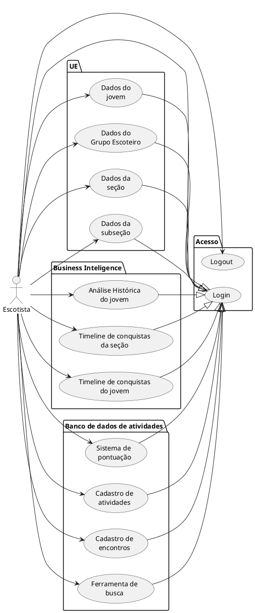

# Arquitetura e casos de uso

```puml
@startuml Architecture

!include https://raw.githubusercontent.com/plantuml-stdlib/C4-PlantUML/master/C4_Container.puml

!define DEVICONS https://raw.githubusercontent.com/tupadr3/plantuml-icon-font-sprites/master/devicons/go.puml
!define DEVICONS2 https://raw.githubusercontent.com/tupadr3/plantuml-icon-font-sprites/master/devicons2/vuejs.puml

' !include DEVICONS/go.puml
' !include DEVICONS2/vuejs.puml


Container(mappa,"mAppa","nodejs","mappa.escoteiros.org.br")
Container(auth,"Autenticação não-UEB","nodejs","em definição")
Container(home, "Escoteirando Dev Home", "VueJS", "Development information portal", $sprite="vuejs")
Container(portal, "Escoteirando Portal","VueJS", "github.com/escoteirando/escoteirando-portal", $sprite="vuejs")
Container(auth, "Serviço de autenticação/autorização","GoLang",$sprite="go")

Container(mappa_proxy, "Mappa Proxy", "GoLang","https://mappa-proxy.fly.dev/", $sprite="go")

Rel(mappa,mappa_proxy,"/api/*")
Rel(auth,mappa_proxy,"/api/*")
Rel(mappa_proxy,portal,"*")
Rel(mappa_proxy,home,"*")
' Person(personAlias, "Label", "Optional Description")
' Container(containerAlias, "Label", "Technology", "Optional Description")
' System(systemAlias, "Label", "Optional Description")

' Rel(personAlias, containerAlias, "Label", "Optional Technology")
@end
```

Domínio principal: escoteirando.net.br

## Casos de Uso Portal Escoteirando


