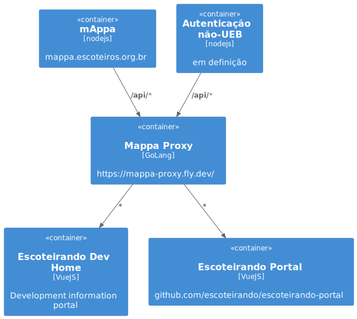

# Suite Escoteirando

Escoteirando é um conjunto de aplicações para apoio do desenvolvimento e compartilhamento de atividades escoteiras.

Domínio principal: escoteirando.net.br

## Casos de Uso Portal Escoteirando

### Login/Logout

Credenciais utilizadas na aplicação mappa (em análise uma interface para login, cadastro de pessoas, grupos, seções, etc que não fazem parte da UEB)

### Dados do grupo escoteiro

Nome do grupo, número e sigla da UF

### Dados da seção

Tipo (alcatéia, tropa, clã), nome

### Dados da(s) subseção(ões)

Nome, lista de jovens

## Business Inteligence

### Análise histórica do jovem

A partir das conquistas, é feita uma análise do período de permanência na seção, o tempo restante até a passagem para o próximo ramo e a comparação entre as progressões/conquistas alcançadas e seu período esperado dentro do segmento.

Esses dados podem predizer as chances de alcançar o término da progressão completa na seção e orientar o caminho.

### Timeline de conquistas da seção

Análise das conquistas gerais podem dar indicações de conquistas que ainda precisam ser exploradas e que podem ser objetivo das atividades.

### Timeline de conquistas do jovem

Quadro de progressões e conquistas alcançadas.

### Cadastro de atividades

Cadastro de atividades, como canções, quebra-gelo, jogos, cerimônias, etc.

Detalhamento de cada atividade, de forma a possibilitar a execução por qualquer escotista. Além de adicionar uma classificação que indique progressões alcançadas com a sua aplicação.

Adição de mídias como imagens, vídeos e áudios.

### Cadastro de encontros

Cadastro de conjuntos de atividades que compõe um encontro.

### Ferramenta de Busca

Busca de atividades, por nome, tipo, descrição, progressção, etc.

### Sistema de pontuação de atividades

As atividades podem receber "curtidas" e comentários de outros usuários, de forma a termos um ranking de boas atividades e uma pontuação para os autores de atividades melhor classificadas.

## Projetos

* [Mappa Proxy](https://github.com/escoteirando/mappa-proxy) -> mappa.escoteirando.net.br

## Links

* https://github.com/plantuml-stdlib/C4-PlantUML
* https://dev.to/mfbmina/enriquecendo-requests-com-traefik-f77
* https://gocopper.dev/
